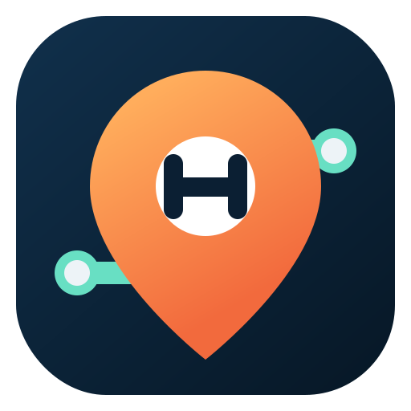

import { VIEW_META, VIEWS } from "../core/constants.js";
import { escapeHtml, initials } from "../core/format.js";
import { icon } from "./icons.js";

const NAV_ITEMS = [
  { id: VIEWS.PLAY, label: "Game", icon: "play" },
  { id: VIEWS.QUESTIONS, label: "Questions", icon: "questions" },
  { id: VIEWS.MAP, label: "Map", icon: "map" }
];

function navButtons(view) {
  return NAV_ITEMS.map((item) => `
    <button class="nav-button" type="button" data-action="navigate" data-view="${item.id}" ${view === item.id ? 'aria-current="page"' : ""}>
      ${icon(item.icon)}${item.label}
    </button>
  `).join("");
}

export function renderShell(state, content) {
  const view = state.ui.view;
  const meta = VIEW_META[view] || VIEW_META.play;
  const connection = state.connection;
  const connected = connection.mode === "connected" && connection.status === "online";
  const connectionLabel = connected ? `Room ${escapeHtml(connection.roomCode || "")}` : state.game ? "Saved on this device" : "Ready to start";
  const statusClass = connection.status === "online" ? "online" : connection.status === "syncing" ? "syncing" : connection.status === "error" ? "error" : "";
  const gameSubtitle = state.game ? `${escapeHtml(state.game.name)} · Round ${state.game.round}` : meta.subtitle;
  return `
    

      <aside class="sidebar" aria-label="Primary navigation">
        

          
          
<strong>HideLine</strong>London companion

        

        <nav class="side-nav">${navButtons(view)}</nav>
        

          <button class="nav-button secondary-nav" type="button" data-action="navigate" data-view="rules">${icon("bookOpen")}Quick rules</button>
          <button class="nav-button secondary-nav" type="button" data-action="open-modal" data-modal="settings">${icon("settings")}Settings</button>
          

            
<strong>${connectionLabel}</strong>

            <small>${connected ? "Live updates are shared." : state.game ? "Connect other phones from Settings." : "Create or join a game."}</small>
          

        

      </aside>
      

        <header class="topbar">
          

            <h1>${meta.title}</h1>
            
${gameSubtitle}

          

          

            ${state.ui.installPromptAvailable ? `<button class="button button-soft button-small" type="button" data-action="install-app">${icon("download")}Install</button>` : ""}
            ${connection.mode === "connected" && !state.settings?.notificationsEnabled ? `<button class="icon-button" type="button" data-action="enable-notifications" aria-label="Enable device notifications" title="Enable device notifications">${icon("bell")}</button>` : ""}
            <button class="icon-button topbar-help" type="button" data-action="navigate" data-view="rules" aria-label="Open quick rules">${icon("bookOpen")}</button>
            <button class="profile-chip" type="button" data-action="open-modal" data-modal="profile" aria-label="Edit profile">
              ${escapeHtml(initials(state.profile.name))}${escapeHtml(state.profile.name)}
            </button>
          

        </header>
        <main id="main-content" class="content" tabindex="-1">${content}</main>
      

      <nav class="mobile-nav" aria-label="Primary navigation">${navButtons(view)}</nav>
    

    <dialog id="app-modal" class="modal"></dialog>
    <dialog id="coordinate-picker-modal" class="modal coordinate-picker-modal"></dialog>
    

    

  `;
}
