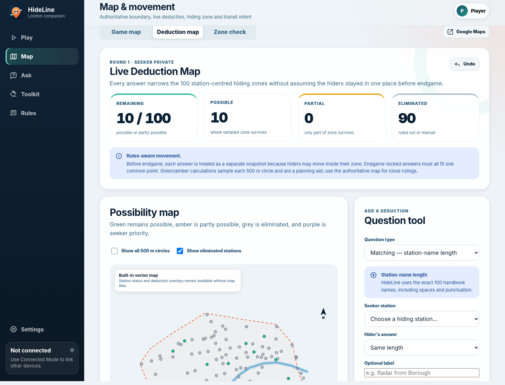

# HideLine — London Hide + Seek Companion

HideLine is an installable, mobile-first progressive web app for the full-day, two-round London transit hide-and-seek format described in the supplied handbook. It is designed to replace scattered stopwatches, notes, question tables, score calculations and team updates with one clear game board.




## What is included

- **Guided two-round game control** with the standard 45-minute hiding period, seeker release, pause accounting, endgame, found confirmation and 4 h 45 min cutoff.
- **A complete investigation workflow** for Matching, Measuring, Thermometer, Radar, Tentacles and Photo questions, including repeat multipliers, answer deadlines, evidence and an auditable history.
- **A private Live Deduction Map** that evaluates all 100 station-centred 500 m zones, labels them possible/partial/eliminated/priority, links supported answers automatically, and provides manual filters, audit history, undo and round reset.
- **The authoritative Google My Maps game layer** embedded in the app, plus separate deduction and zone-check maps with optional team positions and an explicitly labelled approximate boundary.
- **All 100 handbook hiding stations**, searchable and randomisable, with station-name length support and a used-station tracker.
- **Hider tools** for a private station, hiding notes, six-card hand management, power-ups/curses and timestamped time traps.
- **Accurate round scoring** using time traps, percentage bonuses, fixed bonuses, curse adjustments, cures and other penalties.
- **Transit and safety tools** for boarding/off-transit notices, optional location sharing, live TfL status, checklists and timestamped team messages.
- **Local Mode** for one shared device with offline support and private photos stored in IndexedDB rather than browser text storage.
- **Connected Mode** for team-mates and opponents on separate devices using optional Supabase real-time rooms, private team state, presence, private evidence storage and opt-in position visibility.
- **Installable PWA** behavior, a responsive layout, dark-mode support, keyboard focus states and GitHub Pages deployment automation.

## Live Deduction Map

Open **Map → Deduction map** while your team is seeking. The map begins with all 100 handbook station zones and narrows them as answers are recorded.

- **Green — possible:** the full sampled zone remains compatible with the active deductions.
- **Amber — partly possible:** at least one part of the 500 m zone still works, but other sampled parts do not.
- **Grey — eliminated:** no sampled point can satisfy the answer, or the seeker team eliminated it manually.
- **Purple — priority:** a still-possible station marked for attention by the seeker team.

Supported question records can be made map-ready from the normal **Ask** modal. Automatic filters are available for Radar, Thermometer, station-name length, transit-line/exact-stop matching and Thames-side matching. The manual question toolbox also includes exact-reference Measuring. Questions that depend on the curated POI or administrative-boundary layers remain judgement-based; use the station board to eliminate, restore or prioritise stations after checking the authoritative map.

The engine follows the handbook's movement rule. Before endgame, each location answer is treated as a separate snapshot because hiders may move anywhere within their station zone between answers. After endgame, mark the answer **Endgame — fixed hiding spot** and all locked constraints must share one common sampled point. Each zone is sampled at 97 points, so the output is a planning aid rather than an adjudication tool for borderline cases.

In Connected Mode, manual deductions, ignored answers, priority marks and the resulting map are stored in the seeker team's private state. Opponents can see the shared question and its required seeker pin/line information, but not the seeker's elimination board.

## Run locally

Requirements: Node.js 20 or newer. There are no npm runtime dependencies and no build step.

```bash
npm run check
npm run dev
```

Open the local address printed in the terminal, normally `http://127.0.0.1:4173`.

A service worker cannot provide normal offline behavior when the app is opened directly with `file://`; use the development server or a deployed HTTPS site.

## Publish with GitHub Pages

1. Create an empty GitHub repository.
2. Upload the complete contents of this folder, including `.github`, `.nojekyll` and all subfolders.
3. Commit to the `main` branch.
4. In the repository, open **Settings → Pages** and choose **GitHub Actions** as the source.
5. The included workflow runs validation/tests and publishes the site.

The app uses relative URLs, so it works from both a user/organisation Pages site and a project subpath.

## Enable Connected Mode

Local Mode works immediately. Connected Mode needs a Supabase project:

1. Create a Supabase project.
2. Enable **Authentication → Providers → Anonymous Sign-Ins**.
3. For a new project, run [`supabase/migrations/001_hideline.sql`](supabase/migrations/001_hideline.sql) once in the Supabase SQL editor. If the project was already created with HideLine 1.0, also run [`supabase/migrations/002_deduction_map.sql`](supabase/migrations/002_deduction_map.sql).
4. Copy the project URL and anon key from the project API settings.
5. Either place them in `config.js` or enter them in HideLine's Settings screen.

```js
window.HIDELINE_CONFIG = {
  supabaseUrl: "https://YOUR-PROJECT.supabase.co",
  supabaseAnonKey: "YOUR-PUBLIC-ANON-KEY",
  googleMapId: "1lDtKjR7rN1zelD3FjepU1XNvHmnb774"
};
```

The anon key is public by design. The included Row Level Security policies provide the access boundary. Review the schema, retention model and abuse controls before operating a public service. Full setup details are in [`supabase/README.md`](supabase/README.md).

## How the multiplayer privacy model works

- Room data and the player roster are visible only to authenticated room members.
- A team's selected hiding station, card hand, private notes and per-round deduction board are kept in a team-only row.
- Location sharing is off until a player starts it. Hider-side sharing defaults to the same team; seeker-side sharing can be visible to all room members.
- Connected photo evidence is compressed in the browser, uploaded to a private bucket and viewed through a short-lived signed URL.
- Local Mode photos remain in that browser's IndexedDB and are not included in the JSON export.
- Changing team in Connected Mode immediately changes which private team state the device may read.

Read [`PRIVACY.md`](PRIVACY.md) before deployment.

## Map accuracy and game adjudication

The embedded Google My Maps layer is the authoritative boundary/POI reference for play. The Leaflet/OpenStreetMap surfaces are planning tools for the deduction overlays, station-centred 500 m circles and permitted player positions. Their polygon and simplified Thames centreline are explicitly approximate and must not overrule the authoritative layer.

All 100 station centres are embedded so the deduction engine and Zone Check work without a geocoding request. When Leaflet or online tiles are unavailable, the Deduction Map automatically switches to a built-in vector map that still shows station statuses, 500 m zone outlines and supported deduction overlays. The Zone Check service can still use TfL/Nominatim as a fallback when needed. GPS, the authoritative third-party map, fresh tiles and live transport data remain network-dependent. Always check that the selected station is open and reasonably accessible on game day.

## Important gameplay safeguards

HideLine supports the handbook; it does not replace judgement. In particular:

- Real-world safety, staff instructions, access rules and transport rules always take precedence.
- Do not use Street View, reverse-image search or AI to solve the opponent's location.
- A hider must be in a valid station-centred 500 m zone at release; the handbook's backtrack/pause and penalty rule applies otherwise.
- Endgame should be confirmed only when seekers are inside the hiding zone and off transit.
- “Found” means within 2 m **and** the hiders have been spotted.
- Avoid underground/no-signal hiding spots, nuisance locations and photographs that unnecessarily identify bystanders.

## Project structure

```text
.
├── .github/workflows/pages.yml      # test and GitHub Pages deployment
├── assets/                           # icons and install screenshots
├── docs/                             # supplied handbook and architecture notes
├── scripts/                          # local server and data validation
├── src/
│   ├── core/                         # state, timing, score, geography and deduction engine
│   ├── data/                         # stations, embedded coordinates, questions, rules and boundary
│   ├── services/                     # map, location, TfL, Supabase and local evidence
│   └── ui/                           # accessible HTML renderers
├── supabase/migrations/              # Connected Mode schema/RLS/storage setup
├── tests/                            # deterministic core tests
├── config.js                         # deploy-time public configuration
├── manifest.webmanifest              # PWA metadata
└── service-worker.js                 # offline application shell
```

## Quality checks

```bash
npm run validate   # verifies stations, embedded coordinates, questions, line presets and assets
npm test           # runs timing, score, zone-sampling, movement and automatic-deduction tests
npm run check      # runs both
```

The source is plain standards-based HTML, CSS and JavaScript. This keeps the repository easy to inspect, fork and deploy without a framework build chain.

## Licence and third-party material

The original HideLine source code is MIT licensed. The supplied handbook, Google map content, service names, map tiles and external libraries/services have their own owners and terms; they are not relicensed by this repository. See [`THIRD_PARTY_NOTICES.md`](THIRD_PARTY_NOTICES.md). Confirm that you have permission before publishing the handbook or any private map publicly.

HideLine is an independent companion implementation and is not an official product of the creators or publishers of any referenced game, map or transport service.
