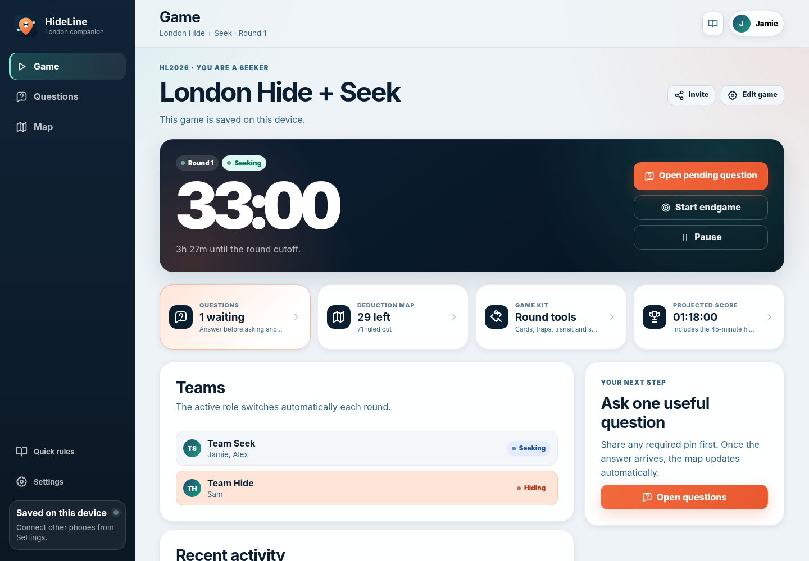
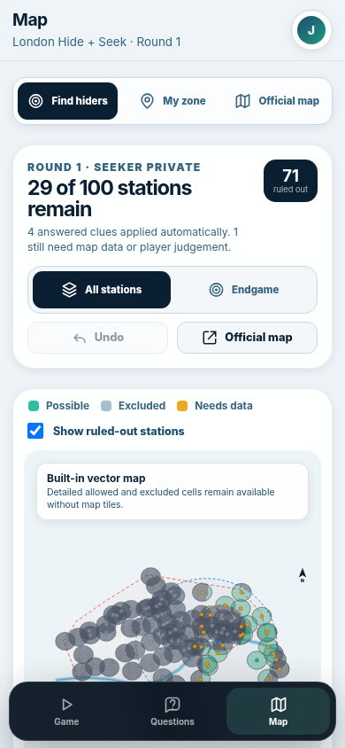

# HideLine — London Hide + Seek Companion

HideLine is an installable, mobile-first companion for the two-round London transit hide-and-seek game in the supplied handbook. Version 2.0 focuses on one goal: **make the game easier to run without turning the app into another rulebook**.





## The game-day interface

There are only three main screens:

1. **Game** — the round timer, the next action, team roles and recent updates.
2. **Questions** — the complete question list, the active answer timer and question history.
3. **Map** — the combined deduction map, the hider's 500 m zone and the official Google map.

Less-used controls are kept out of the main navigation:

- Cards, traps, transit notices and scoring live in one collapsed **Game kit**.
- Imported map data, answer auditing and deduction reset controls are collapsed below the map.
- Quick rules and app settings remain available without taking space from the three game screens.

## What the app handles

- The 45-minute hiding period, pause-aware seeking time, Endgame and round cutoff.
- All 55 handbook questions with the correct 5- or 10-minute answer timer and repeat reward display.
- All 100 handbook hiding stations and their 500 m zones.
- A private seeker deduction map that automatically combines every usable answer.
- A dedicated fixed-location Endgame circle with a clear **Back to all stations** action.
- Hider cards, time traps, transit notifications and the handbook score formula.
- Optional room-code multiplayer with team-private station, card and deduction data.
- Offline application-shell support after the first successful load.

## The simplified deduction map

The seeker map no longer asks players to choose between technical layers. It always shows the combined result:

- **Green** — the coordinate remains possible.
- **Grey** — at least one answered question excludes it.
- **Amber** — the clue needs source map data or player judgement.

The heading shows how many stations remain. The station list, answer audit and map setup are available below the map but stay collapsed until needed.

Before Endgame, each answer is treated as a separate snapshot because the hiders may move within their station zone between questions. During Endgame, new answers are intersected at one fixed location because the hiders must remain at the hiding spot.

Radar, Thermometer, station-name, transit-line and Thames-side deductions work immediately. Tentacles and questions based on curated points of interest or administrative boundaries need the Google My Maps KML/KMZ imported once under **Map setup and reset**. When source geometry is unavailable, HideLine marks the clue as unresolved rather than inventing an answer.

The deduction grid is a planning aid. The official game map and normal player judgement remain authoritative for borderline paths, entrances, station pins and disputed points of interest.

## Run locally

Requirements: Node.js 20 or newer. There are no runtime npm dependencies and no build step.

```bash
npm run check
npm run dev
```

Open the address printed in the terminal, normally `http://127.0.0.1:4173`.

## Publish with GitHub Pages

1. Upload the complete contents of this repository to the `main` branch.
2. Open **Settings → Pages** in GitHub.
3. Choose **GitHub Actions** as the source.
4. The included workflow validates the data, runs the tests and deploys the static app.

The app uses relative URLs, so it works from a GitHub project subpath such as `https://USERNAME.github.io/HideLine/`.

## Enable Connected Mode

Local Mode works immediately. Connected Mode requires a Supabase project:

1. Enable anonymous sign-ins in Supabase.
2. For a new installation, run [`supabase/migrations/001_hideline.sql`](supabase/migrations/001_hideline.sql).
3. An installation originally created with HideLine 1.0 must also run [`supabase/migrations/002_deduction_map.sql`](supabase/migrations/002_deduction_map.sql).
4. Put the project URL and public anon key in `config.js`, or enter them under **Settings → Connected Mode setup**.

```js
window.HIDELINE_CONFIG = {
  supabaseUrl: "https://YOUR-PROJECT.supabase.co",
  supabaseAnonKey: "YOUR-PUBLIC-ANON-KEY",
  googleMapId: "1lDtKjR7rN1zelD3FjepU1XNvHmnb774"
};
```

HideLine 2.0 requires **no new Supabase migration** when upgrading from 1.1, 1.2 or 1.3. Full backend instructions are in [`supabase/README.md`](supabase/README.md).

## Privacy model

- The selected hiding station, hider cards and seeker deductions are stored in team-private state.
- A connected hider device cannot open the seeker deduction map.
- Location sharing is opt-in and hider sharing defaults to the hider team only.
- Connected photo answers use a private storage bucket and short-lived signed links.
- Local photo answers stay in the browser's IndexedDB.

Read [`PRIVACY.md`](PRIVACY.md) before operating a public deployment.

## Important safeguards

- Stop walking before using the app near roads, stairs or platforms.
- Follow transport staff instructions and real-world access restrictions.
- Do not use Street View, reverse-image search or AI to solve the opponent's location.
- At seeker release, hiders must be inside a valid station-centred 500 m zone.
- Confirm Endgame only when the seekers are inside the hiding zone and off transit.
- “Found” means the seekers are within 2 m and have spotted the hiders.

## Project structure

```text
.
├── .github/workflows/pages.yml      # tests and GitHub Pages deployment
├── assets/                           # icons and install screenshots
├── docs/                             # handbook and architecture notes
├── scripts/                          # local server and data validation
├── src/
│   ├── core/                         # state, timing, scoring and deduction engine
│   ├── data/                         # stations, coordinates, questions and rules
│   ├── services/                     # maps, location, Supabase and evidence
│   └── ui/                           # accessible HTML renderers
├── supabase/migrations/              # Connected Mode schema and policies
├── tests/                            # deterministic core and UI tests
├── config.js                         # public deployment configuration
├── manifest.webmanifest              # install metadata
└── service-worker.js                 # offline application shell
```

## Quality checks

```bash
npm run validate
npm test
npm run check
```

The project is plain HTML, CSS and JavaScript so it remains easy to inspect, change and upload directly to GitHub.

## Licence and third-party material

The original HideLine source is MIT licensed. The supplied handbook, Google map content, transport names, external services and map tiles retain their respective ownership and terms. See [`THIRD_PARTY_NOTICES.md`](THIRD_PARTY_NOTICES.md).

HideLine is an independent companion implementation and is not an official product of the creators or publishers of any referenced game, map or transport service.
