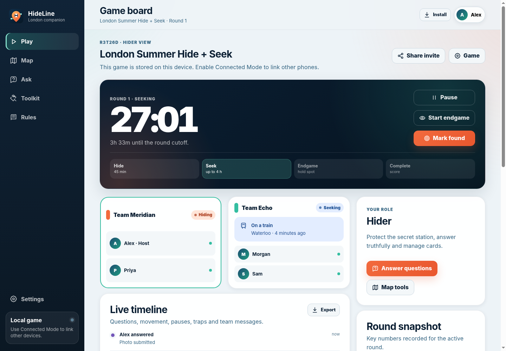
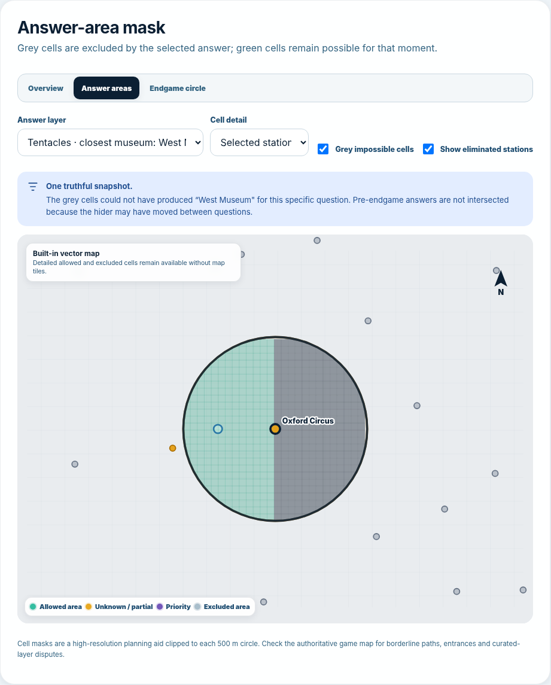
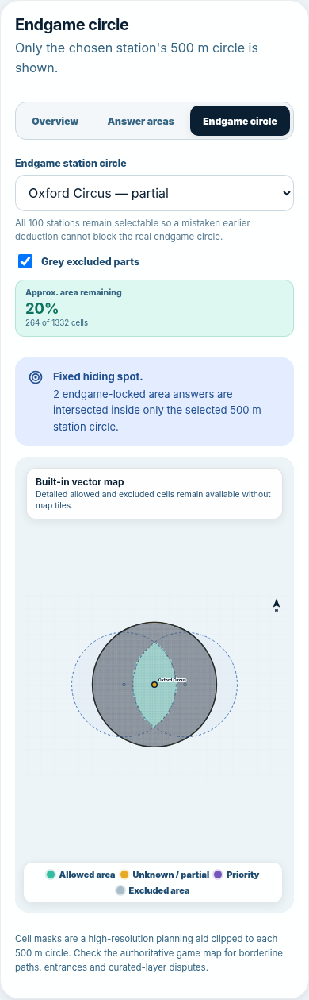

# HideLine — London Hide + Seek Companion

HideLine is an installable, mobile-first progressive web app for the full-day, two-round London transit hide-and-seek format described in the supplied handbook. It is designed to replace scattered stopwatches, notes, question tables, score calculations and team updates with one clear game board.







## What is included

- **Guided two-round game control** with the standard 45-minute hiding period, seeker release, pause accounting, endgame, found confirmation and 4 h 45 min cutoff.
- **A complete investigation workflow** for Matching, Measuring, Thermometer, Radar, Tentacles and Photo questions, including repeat multipliers, answer deadlines, evidence and an auditable history.
- **A private Live Deduction Map** with a combined all-answer exclusion overlay inside every 500 m station circle, optional single-answer inspection, all 55 handbook questions linked to the audit trail, automatic POI/region/Tentacle geometry after map-data import, and a dedicated fixed-spot Endgame circle.
- **The authoritative Google My Maps game layer** embedded in the app, plus separate deduction and zone-check maps with optional team positions and an explicitly labelled approximate boundary.
- **All 100 handbook hiding stations**, searchable and randomisable, with station-name length support and a used-station tracker.
- **Hider tools** for a private station, hiding notes, six-card hand management, power-ups/curses and timestamped time traps.
- **Accurate round scoring** using time traps, percentage bonuses, fixed bonuses, curse adjustments, cures and other penalties.
- **Transit and safety tools** for boarding/off-transit notices, optional location sharing, live TfL status, checklists and timestamped team messages.
- **Local Mode** for one shared device with offline support and private photos stored in IndexedDB rather than browser text storage.
- **Connected Mode** for team-mates and opponents on separate devices using optional Supabase real-time rooms, private team state, presence, private evidence storage and opt-in position visibility.
- **Installable PWA** behavior, a responsive layout, dark-mode support, keyboard focus states and GitHub Pages deployment automation.

## Live Deduction Map

Open **Map → Deduction map** while your team is seeking. All deductions use one private audit trail, but the map has three deliberately different views:

1. **Overview** shows the viability of all 100 station-centred hiding zones.
2. **Answer areas** defaults to **All linked answers — combined overlay** and clips a detailed cell mask to every visible 500 m circle. Grey means one or more ready answers excludes that cell, with darker grey indicating more exclusions. Green survives every displayed ready answer at that coordinate; amber still needs a required map layer or human review. The selector can still isolate any one answer for a clean single-question mask.
3. **Endgame circle** hides the rest of London, shows only the chosen station's 500 m circle, and intersects every answer marked **Endgame — fixed hiding spot** at one common location.

The station overview uses these statuses:

- **Green — possible:** the full sampled station zone remains compatible with the active deductions.
- **Amber — partly possible:** at least one answer cuts through the station circle. Select **Inspect area** to see the surviving portion.
- **Grey — eliminated:** no sampled point can satisfy an answer, or the seeker team eliminated the station manually.
- **Purple — priority:** a still-possible station marked for attention by the seeker team.

### All questions are linked

Every one of the 55 handbook questions is mapped to one of two workflows:

- **Automatic area geometry:** Radar, Thermometer, station-name length, transit-line/exact-stop matching, Thames-side matching, nearest-feature matching, borough/constituency/ward matching, nearest-feature Measuring, nearest hiding-station Measuring and all four Tentacle categories.
- **Guided map review:** altitude/floor and Photo questions. These remain linked to the answer record, but the seeker team draws a fair manual circle or polygon, or makes manual station decisions, instead of the app guessing from an image.

POI, street/path and administrative questions need the same reference geometry used during play. In **Deduction Map → Map data**, import the Google My Maps export as **KML/KMZ**, or import compatible GeoJSON. HideLine classifies and simplifies the layers locally, then uses them for nearest-feature regions, distances, containment and Tentacle Voronoi-style areas. Radar, Thermometer, station-name, transit, nearest-station and Thames tools work without an import.

For a Tentacle answer, HideLine first selects only the imported POIs of that category within 2 km of the seeker's pinned location. It then keeps the parts of each hiding circle from which the named POI is the closest member of that valid set.

### Movement-aware area logic

Before endgame, each answer is a separate location snapshot because the hider can move within the same 500 m station zone between questions. The combined Answer Areas view is therefore presented as an **evidence overlay**, not as proof that the hider remained at one fixed point. It shows every exclusion together for planning, while the station viability engine continues to assess each mobile answer separately. A station is not eliminated merely because the combined overlay has no single common green cell when different answers could have been given from different points in its zone.

Use **Show all areas** above the linked-answer list to return to the combined overlay after inspecting one question. Use **Show all circles** in the Endgame view, or select **Overview**, to clear the Endgame focus and fit the complete station map again without deleting any deductions.

Once endgame has genuinely begun, new answers are marked **Endgame — fixed hiding spot** automatically. The **Endgame circle** intersects those locked answers because they must all be true at the same physical point. All 100 stations remain selectable in that view so an earlier mistaken deduction cannot prevent the team from opening the correct circle.

The detailed mask is a high-resolution planning grid clipped to the exact 500 m circle. It is intentionally presented as an approximation: use the authoritative game map and normal player judgement for borderline paths, entrances, disputed POIs and source-layer inaccuracies.

In Connected Mode, the elimination board, imported geometry, manual areas, ignored answers, priority marks and Endgame mask are stored in the seeker team's private state. Opponents still see the shared question details needed to answer, but not the seeker's deductions.

## Run locally

Requirements: Node.js 20 or newer. There are no npm runtime dependencies and no build step.

```bash
npm run check
npm run dev
```

Open the local address printed in the terminal, normally `http://127.0.0.1:4173`.

A service worker cannot provide normal offline behavior when the app is opened directly with `file://`; use the development server or a deployed HTTPS site.

## Publish with GitHub Pages

1. Create an empty GitHub repository.
2. Upload the complete contents of this folder, including `.github`, `.nojekyll` and all subfolders.
3. Commit to the `main` branch.
4. In the repository, open **Settings → Pages** and choose **GitHub Actions** as the source.
5. The included workflow runs validation/tests and publishes the site.

The app uses relative URLs, so it works from both a user/organisation Pages site and a project subpath.

## Enable Connected Mode

Local Mode works immediately. Connected Mode needs a Supabase project:

1. Create a Supabase project.
2. Enable **Authentication → Providers → Anonymous Sign-Ins**.
3. For a new project, run [`supabase/migrations/001_hideline.sql`](supabase/migrations/001_hideline.sql) once in the Supabase SQL editor. If the project was originally created with HideLine 1.0, also run [`supabase/migrations/002_deduction_map.sql`](supabase/migrations/002_deduction_map.sql). HideLine 1.3 needs no additional database migration.
4. Copy the project URL and anon key from the project API settings.
5. Either place them in `config.js` or enter them in HideLine's Settings screen.

```js
window.HIDELINE_CONFIG = {
  supabaseUrl: "https://YOUR-PROJECT.supabase.co",
  supabaseAnonKey: "YOUR-PUBLIC-ANON-KEY",
  googleMapId: "1lDtKjR7rN1zelD3FjepU1XNvHmnb774"
};
```

The anon key is public by design. The included Row Level Security policies provide the access boundary. Review the schema, retention model and abuse controls before operating a public service. Full setup details are in [`supabase/README.md`](supabase/README.md).

## How the multiplayer privacy model works

- Room data and the player roster are visible only to authenticated room members.
- A team's selected hiding station, card hand, private notes, imported spatial layers and per-round deduction/Endgame boards are kept in a team-only row.
- Location sharing is off until a player starts it. Hider-side sharing defaults to the same team; seeker-side sharing can be visible to all room members.
- Connected photo evidence is compressed in the browser, uploaded to a private bucket and viewed through a short-lived signed URL.
- Local Mode photos remain in that browser's IndexedDB and are not included in the JSON export.
- Changing team in Connected Mode immediately changes which private team state the device may read.

Read [`PRIVACY.md`](PRIVACY.md) before deployment.

## Map accuracy and game adjudication

The embedded Google My Maps layer remains the authoritative boundary/POI reference for play. The Leaflet/OpenStreetMap surface, mask grid, embedded station centres and simplified Thames centreline are planning tools and must not overrule the source map.

Importing the My Maps KML/KMZ allows HideLine to calculate from the actual exported POI, line and polygon geometry rather than inventing substitute locations. Classification depends on layer/name labels, so review the imported category counts and keep unclassified features out of automatic deductions until they are correctly labelled in the source or supplied as GeoJSON with a `category` property.

All 100 station centres are embedded so the station engine and Zone Check work without geocoding. When Leaflet or online tiles are unavailable, the Deduction Map switches to a built-in vector map that still renders station statuses, detailed cell masks and supported overlays. Selected Answer Areas and Endgame automatically focus on the chosen 500 m circle in this fallback. GPS, source-map access, fresh tiles and live transport data remain network-dependent. Always check that the selected station is open and reasonably accessible on game day.

## Important gameplay safeguards

HideLine supports the handbook; it does not replace judgement. In particular:

- Real-world safety, staff instructions, access rules and transport rules always take precedence.
- Do not use Street View, reverse-image search or AI to solve the opponent's location.
- A hider must be in a valid station-centred 500 m zone at release; the handbook's backtrack/pause and penalty rule applies otherwise.
- Endgame should be confirmed only when seekers are inside the hiding zone and off transit.
- “Found” means within 2 m **and** the hiders have been spotted.
- Avoid underground/no-signal hiding spots, nuisance locations and photographs that unnecessarily identify bystanders.

## Project structure

```text
.
├── .github/workflows/pages.yml      # test and GitHub Pages deployment
├── assets/                           # icons and install screenshots
├── docs/                             # supplied handbook and architecture notes
├── scripts/                          # local server and data validation
├── src/
│   ├── core/                         # state, timing, score, geography, spatial and deduction engines
│   ├── data/                         # stations, coordinates, questions, map links, rules and boundary
│   ├── services/                     # map, KML/KMZ import, location, TfL, Supabase and evidence
│   └── ui/                           # accessible HTML renderers
├── supabase/migrations/              # Connected Mode schema/RLS/storage setup
├── tests/                            # deterministic core tests
├── config.js                         # deploy-time public configuration
├── manifest.webmanifest              # PWA metadata
└── service-worker.js                 # offline application shell
```

## Quality checks

```bash
npm run validate   # verifies stations, embedded coordinates, questions, line presets and assets
npm test           # runs timing, score, area masks, all-question mapping, Tentacles and Endgame tests
npm run check      # runs both
```

The source is plain standards-based HTML, CSS and JavaScript. This keeps the repository easy to inspect, fork and deploy without a framework build chain.

## Licence and third-party material

The original HideLine source code is MIT licensed. The supplied handbook, Google map content, service names, map tiles and external libraries/services have their own owners and terms; they are not relicensed by this repository. See [`THIRD_PARTY_NOTICES.md`](THIRD_PARTY_NOTICES.md). Confirm that you have permission before publishing the handbook or any private map publicly.

HideLine is an independent companion implementation and is not an official product of the creators or publishers of any referenced game, map or transport service.
