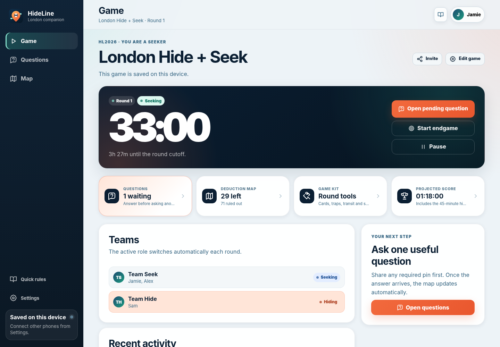
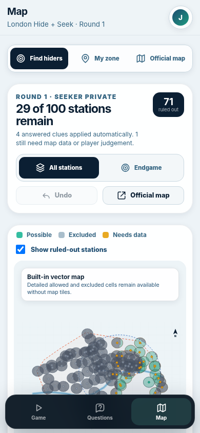

# HideLine — London Hide + Seek Companion

HideLine is an installable, mobile-first companion for the two-round London transit hide-and-seek game in the supplied handbook. Version 2.3.3 makes the Body of Water workflow game-day ready with an always-visible mobile confirmation bar and a bundled Central London water-edge atlas that powers both teams' calculations and the Find Hiders map.





## What is new in 2.3.3

- **The map no longer blocks confirmation:** the water picker is split into a scrollable map area and a separate footer. **Use this water edge**, **Cancel** and the selected coordinates remain visible below the map on phones, including small screens and installed PWAs.
- **Automatic nearest-edge selection:** after a player chooses their location, HideLine immediately finds the nearest valid bank or shoreline. The map is now a review step, not a compulsory manual measurement step.
- **Built-in water-edge atlas:** 36 major named rivers, canals, docks, basins and park lakes across the game area are bundled with the app as line or polygon geometry. This includes the River Thames, Regent's Canal, Canada Water lake, the Serpentine and the main Surrey Docks waters.
- **Find Hiders shading works without an import:** Body of Water answers now compare each sampled candidate point with its own nearest built-in named water edge. The question no longer stays unresolved merely because Google My Maps did not contain water polygons.
- **Safer imported data:** a same-named station pin or water POI cannot overwrite a usable built-in shoreline. Swimming pools, fountains and point placemarks remain excluded.
- **Manual review remains available:** tap another blue edge when the automatic choice is wrong. Tiny or omitted waters can still be entered manually, but the bundled atlas is used by default for consistent game-day deductions.

## What changed in 2.3.2

- Removed the Body of Water place-name dropdown completely, so station names and incomplete water placemarks can no longer be selected accidentally.
- Added separate seeker and hider distance calculators, with private hider coordinates and a shared seeker baseline.
- Added map keys, measurement lines, Google Maps links and legacy-question protection.

## What changed in 2.3.1

- **Boundary requests repaired:** boroughs, wards and constituencies use fixed ONS `FeatureServer/0/query` layers and simple spatial queries rather than the retired HTML/MapServer routes that produced the reported errors.
- **Two-format boundary fallback:** each layer first requests GeoJSON and automatically retries as ArcGIS JSON when a service or browser rejects GeoJSON. Valid Central London polygons are cached after the first successful load.
- **Per-layer status:** the Map Data panel shows separate Ready/Unavailable states for London boroughs, electoral wards and parliamentary constituencies, with one control to clear an invalid cache and retry.

## What is new in 2.3.0

- **Exact timer starts:** **Start now** records the precise second the button is pressed. A scheduled start is optional and now accepts seconds, so a three-minute test no longer begins part-way through.
- **Question drafts survive live updates:** coordinates, selected POIs, notes, checkboxes and other unsaved form values are restored after Connected Mode receives a remote update.
- **Answers are one tap away:** **View answer** opens a complete answer card from the notification, Questions history, latest-answer card or Recent Activity.
- **Accurate boundary handling:** the exact red Game Area boundary is drawn only from the supplied Google My Map. HideLine attempts to load it automatically; when Google blocks the KML download, the app shows a clearly labelled amber fallback until the KML/KMZ is imported.
- **Transparent measuring calculations:** the active question and hider map name the exact feature used, show the seeker pin, the exact edge/pin/line point, the measured distance and the method. With hider GPS available, the map also highlights the hider's own nearest valid reference in teal.
- **Built-in administrative layers:** London boroughs, electoral wards and Westminster constituencies load from built-in official ONS FeatureServer source definitions and are cached for later game-day use. They no longer depend on the Google My Map import.
- **Tentacle answer lists:** the hider receives a drop-down containing only the valid mapped POIs within two kilometres of the seeker pin.
- **POI matching and measuring lists:** when asking park, zoo, museum, cinema, hospital, library, consulate and similar questions, seekers can confirm the exact mapped feature or leave the app to choose the nearest one automatically.

## What was added in 2.1

- **More accurate Thames guidance:** the old coarse centreline has been replaced by a 614-point planning guide generated from 57 bridge-anchored control points and interpolated at roughly 35 m spacing. The online map leaves the OpenStreetMap water polygon visible instead of drawing a thick approximate river over it.
- **Earlier clues remain visible in Endgame:** station-level facts and answers recorded while the hider is fixed remain hard red exclusions. Pre-Endgame location answers are carried into the selected circle as a blue overlap hint because the hider was allowed to move after answering. No question needs to be asked again merely to show its earlier result.
- **Pick coordinates from map:** every coordinate-based question now has a button that opens a map. Tap the location or drag the marker, optionally use device GPS, then choose **Use this point**. HideLine fills the latitude, longitude and shared Google Maps pin.


### Deployment repair in 2.2.1

Version 2.2.1 stores a display-ready coordinate list directly on each question, rechecks pending questions if a Realtime event is missed, and includes a visible **Test pop-up** control under **Settings → Game notifications**. The page also checks that the matching 2.2.1 JavaScript loaded; a red deployment warning means the repository contains mixed versions or files in the wrong folder.

Do not upload files from a Windows search-results view or directly from inside a compressed ZIP. That can flatten files such as `src/ui/question-location.js` into the repository root, where the app cannot use them. Extract the package first and preserve its folders, or use the supplied 2.2.1 repair kit, which applies the complete source tree through GitHub Actions while preserving `config.js`.

## The game-day interface

There are only three main screens:

1. **Game** — the round timer, the next action, team roles and recent updates.
2. **Questions** — the complete question list, the active answer timer and question history.
3. **Map** — the combined deduction map, the hider's 500 m zone and the official Google map.

Less-used controls are kept out of the main navigation:

- Cards, traps, transit notices and scoring live in one collapsed **Game kit**.
- Imported map data, answer auditing and deduction reset controls are collapsed below the map.
- Quick rules and app settings remain available without taking space from the three game screens.

## What the app handles

- The 45-minute hiding period, pause-aware seeking time, Endgame and round cutoff.
- All 55 handbook questions with the correct 5- or 10-minute answer timer and repeat reward display.
- All 100 handbook hiding stations and their 500 m zones.
- A private seeker deduction map that automatically combines every usable answer.
- A dedicated fixed-location Endgame circle with a clear **Back to all stations** action.
- Hider cards, time traps, transit notifications and the handbook score formula.
- Optional room-code multiplayer with team-private station, card and deduction data.
- Offline application-shell support after the first successful load.

Important live events create in-app pop-ups automatically. Device notifications are optional and require browser permission; they can appear while the installed web app is open in the background, but a mobile operating system may suspend a fully closed PWA.

## The simplified deduction map

The seeker map no longer asks players to choose between technical layers. It always shows the combined result:

- **Green** — the coordinate remains possible.
- **Grey** — at least one answered question excludes it.
- **Amber** — the clue needs source map data or player judgement.

In the dedicated Endgame circle, the current fixed-location result is deliberately simple: the pale-green base is currently in play and strong red is ruled out. A light-blue overlay shows where all earlier mobile clues overlap at one point without pretending that those clues fix the final hiding spot.

The heading shows how many stations remain. The station list, answer audit and map setup are available below the map but stay collapsed until needed.

Before Endgame, each answer is treated as a separate snapshot because the hiders may move within their station zone between questions. In Endgame, all earlier clues are brought into the chosen 500 m circle automatically. A clue that rules out the entire station remains a hard red result; other earlier mobile answers appear only as a blue overlap hint. New Endgame answers are intersected at one fixed location because the hiders must remain at the hiding spot.

Radar, Thermometer, station-name, transit-line and Thames-side deductions work immediately. Coordinate-based question forms include **Pick coordinates from map**, so players do not need to look up or type latitude and longitude manually. Tentacles and questions based on curated points of interest need the Google My Maps KML/KMZ. HideLine tries to load that public map automatically and also offers a one-tap loader or manual import. London borough, electoral ward and constituency polygons load separately from built-in official sources and are cached by the browser. When source geometry is unavailable, HideLine marks the clue as unresolved rather than inventing an answer.

The deduction grid is a planning aid. The official game map and normal player judgement remain authoritative for borderline paths, entrances, station pins and disputed points of interest.

## Run locally

Requirements: Node.js 20 or newer. There are no runtime npm dependencies and no build step.

```bash
npm run check
npm run dev
```

Open the address printed in the terminal, normally `http://127.0.0.1:4173`.

## Publish with GitHub Pages

1. Upload the complete contents of this repository to the `main` branch.
2. Open **Settings → Pages** in GitHub.
3. Choose **GitHub Actions** as the source.
4. The included workflow validates the data, runs the tests and deploys the static app.

The app uses relative URLs, so it works from a GitHub project subpath such as `https://USERNAME.github.io/HideLine/`.

## Enable Connected Mode

Local Mode works immediately. Connected Mode requires a Supabase project:

1. Enable anonymous sign-ins in Supabase.
2. For a new installation, run [`supabase/migrations/001_hideline.sql`](supabase/migrations/001_hideline.sql).
3. An installation originally created with HideLine 1.0 must also run [`supabase/migrations/002_deduction_map.sql`](supabase/migrations/002_deduction_map.sql).
4. Put the project URL and public anon key in `config.js`, or enter them under **Settings → Connected Mode setup**.

```js
window.HIDELINE_CONFIG = {
  supabaseUrl: "https://YOUR-PROJECT.supabase.co",
  supabaseAnonKey: "YOUR-PUBLIC-ANON-KEY",
  googleMapId: "1lDtKjR7rN1zelD3FjepU1XNvHmnb774"
};
```

HideLine 2.3.3 requires **no new Supabase migration**. The built-in water atlas, mobile picker fix, water-feature filtering and administrative-boundary fixes are client-side, as were the 2.3.0 timer, form-draft, answer-view and POI changes. Existing projects that have not already applied the room-join repair should run `supabase/migrations/003_fix_join_game_ambiguity.sql`. Full backend instructions are in [`supabase/README.md`](supabase/README.md).

## Privacy model

- The selected hiding station, hider cards and seeker deductions are stored in team-private state.
- A connected hider device cannot open the seeker deduction map.
- Location sharing is opt-in and hider sharing defaults to the hider team only.
- Connected photo answers use a private storage bucket and short-lived signed links.
- Local photo answers stay in the browser's IndexedDB.

Read [`PRIVACY.md`](PRIVACY.md) before operating a public deployment.

## Map accuracy

The Google My Map remains the authoritative Game Area, station and curated-POI reference. HideLine draws it in red only when that exact polygon has loaded; the amber line is explicitly a fallback guide. OpenStreetMap supplies the visible street and river-bank basemap. Official GLA/ONS services supply the administrative polygons used for borough, ward and constituency questions. HideLine's remapped Thames guide, built-in water-edge atlas, deduction grid, station centres, 500 m circles and offline vector map are planning aids rather than surveyed boundaries. Use normal player judgement for bridges, tunnels, islands, foreshore, borderline paths and source-layer disputes.

## Important safeguards

- Stop walking before using the app near roads, stairs or platforms.
- Follow transport staff instructions and real-world access restrictions.
- Do not use Street View, reverse-image search or AI to solve the opponent's location.
- At seeker release, hiders must be inside a valid station-centred 500 m zone.
- Confirm Endgame only when the seekers are inside the hiding zone and off transit.
- “Found” means the seekers are within 2 m and have spotted the hiders.

## Project structure

```text
.
├── .github/workflows/pages.yml      # tests and GitHub Pages deployment
├── assets/                           # icons and install screenshots
├── docs/                             # handbook and architecture notes
├── scripts/                          # local server and data validation
├── src/
│   ├── core/                         # state, timing, scoring and deduction engine
│   ├── data/                         # stations, coordinates, questions and rules
│   ├── services/                     # maps, location, Supabase and evidence
│   └── ui/                           # accessible HTML renderers
├── supabase/migrations/              # Connected Mode schema and policies
├── tests/                            # deterministic core and UI tests
├── config.js                         # public deployment configuration
├── manifest.webmanifest              # install metadata
└── service-worker.js                 # offline application shell
```

## Quality checks

```bash
npm run validate
npm test
npm run check
```

The project is plain HTML, CSS and JavaScript so it remains easy to inspect, change and upload directly to GitHub. The automated checks cover the 100 stations, all 55 linked questions, the 614-point Thames guide, exact timer starts, modal-draft persistence, direct answer viewing, measurement-edge calculations, official administrative source definitions, Tentacle/POI lists, Endgame carry-forward masks and repository-folder integrity.

## Licence and third-party material

The original HideLine source is MIT licensed. The supplied handbook, Google map content, transport names, external services and map tiles retain their respective ownership and terms. See [`THIRD_PARTY_NOTICES.md`](THIRD_PARTY_NOTICES.md).

HideLine is an independent companion implementation and is not an official product of the creators or publishers of any referenced game, map or transport service.
